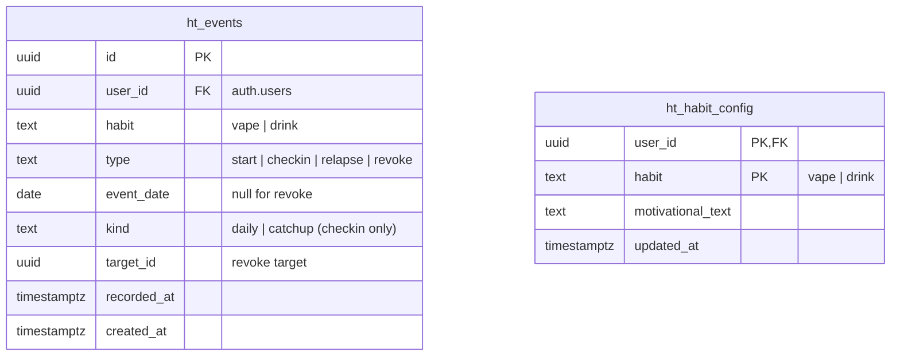

# feat: Sobriety Habit Tracker PWA

## Routing Summary

| Runner | Units | |
|---|---|---|
| `codex-delegate` | 8 | Units 1, 3, 4, 5, 6, 7, 9, 10 |
| `claude` | 2 | Units 2, 11 |
| `hybrid` | 1 | Unit 8 |

**Claude-tagged justifications:**
- **Unit 2 (GitHub/Vercel/branch protection)**: account-level operations against live services (`gh api`, Vercel linking, Supabase dashboard steps) that may need interactive auth and require judgement-based verification against real infrastructure — not delegable to a sandboxed builder.
- **Unit 11 (E2E verification + first deploy)**: final verification judgement, real-device/browser checks, and deploy sign-off — the "evidence before claims" gate.
- **Unit 8 (hybrid)**: Claude establishes the design system and main screen (design judgement, `frontend-design` skill, screenshot iteration); Codex then fills the remaining screens following the established pattern. Handoff point defined in the unit.

## Overview

Single-user, installable iOS PWA showing two "days since" counters (vaping, drinking) with a daily check-in ritual, dignified celebration UX, and durable streak data. Local-first: the device is the working store and works fully offline; Supabase (existing `whole-life-challenge` project, reference `lnnvwbqmpgusjoplvjjt`) is the append-only backup and recovery source. Auth is a one-time email OTP per device. Greenfield build at `parnell-systems/HabitTracker`.

All product decisions were made in the origin document (see origin: `docs/brainstorms/2026-07-07-sobriety-habit-tracker-requirements.md`) — R-numbers below refer to it. This plan resolves the four deferred questions plus the gaps found in SpecFlow analysis.

## Key Planning Decisions

1. **Event-sourced state, not mutable aggregates** *(resolves the origin's sync-conflict question and a critical SpecFlow finding)*. The origin doc had both an append-only `checkins` log and mutable habit fields (`longest streak`, `total clean days`) merged last-write-wins — LWW on aggregates can silently drop a relapse recorded on another device, violating "a relapse never destroys historical data". Instead: an **append-only event log is the sole source of truth**; all habit state is a **pure fold** over the merged events. Sync becomes union-by-ID (conflict-free by construction). Config (motivational text) stays LWW — it's cosmetic. Corrections are `revoke` events (tombstones), giving R7 a true undo without polluting lifetime stats.
2. **Auth-before-setup gate** *(critical SpecFlow finding)*. On a fresh device, the order is: email OTP auth → pull from Supabase → **only if the cloud is empty**, offer first-run setup. A replacement phone must never create fresh state that overwrites the cloud streak.
3. **Email OTP code, not clickable magic link** *(refines R10)*. On iOS, a magic link tapped in Mail opens Safari, whose storage is partitioned from the installed PWA — the session never reaches the app. The user instead types a 6-digit code from the email into the app (`signInWithOtp` → `verifyOtp`, same Supabase feature). One-time per device, as decided in the origin.
4. **Fri/Sat windows** *(resolves deferred question)*: the supportive line shows when the main screen renders during Fri/Sat 18:00–23:59 local. The warmer "made it through" note shows on a clean check-in recorded on a Saturday or Sunday (covering the prior hard night). **Precedence: made-it-through wins**; never show both at once.
5. **Motivational text is user-editable** *(resolves deferred question)*: editable per habit in the hamburger settings, with sensible defaults baked in at setup.
6. **Settings corrections reuse the relapse component** *(resolves deferred question)*: settings offers "correct start date" (appends a corrective `start` event — no lifetime-stat side effects) and "undo last relapse" (appends `revoke`). Both use the same date-picker + "Confirm" component as the relapse flow. Relapses themselves are never logged from settings (R3a).
7. **Stack**: Vite + vanilla TypeScript (two screens; no framework weight — "super minimal"), Vitest, `@supabase/supabase-js`, `vite-plugin-pwa`. Version injection follows the WLC `vite.config.js` reference pattern (semver + git SHA in footer). Static hosting on Vercel.
8. **Table prefix `ht_`**: tables live in the shared WLC Supabase project — prefixing prevents collision with WLC's schema. Migration SQL lives in **this repo** (`supabase/migrations/`) and is applied **manually** to the WLC project — never auto-applied (see Unit 5).
9. **Milestone naming/spec** *(SpecFlow fixes)*: milestones are **1 day** (not "24h" — day-boundary logic is calendar-date based per R5), 7, 30, 60, 90, 180, 270, 365 days, then yearly. Multiple milestones crossed in one catch-up celebrate the **highest only**. `lastCelebratedMilestone` is **device-local UI state** (not synced) initialised to the highest milestone ≤ current streak on setup/restore, so nothing fires retroactively.
10. **Relapse-day semantics** *(SpecFlow fix)*: the relapse day is day 0 of the new streak. `endedLength = daysBetween(oldStart, relapseDate)` (relapse day excluded from the old streak); the counter shows 0 on the relapse day and 1 the next morning.

## Architecture

### Data model

- `ht_events`: append-only. RLS: `select`/`insert` where `user_id = auth.uid()`; **no update/delete policies** (append-only enforced at the DB).
- `ht_habit_config`: LWW by `updated_at`. RLS: all ops on own rows.
- The local store mirrors the same shapes in `localStorage` plus device-only UI state (`lastCelebratedMilestone`, sync cursor, session).

### Fold specification (pure function — the heart of the app)

`fold(events: Event[], today: ISODate) → per-habit HabitState`:

- Ignore any event revoked by a non-revoked `revoke`.
- **Anchors** = non-revoked `start` and `relapse` events, sorted by `event_date` (ties by `recorded_at`; latest `start` correction wins).
- `streakStartDate` = date of the latest anchor. Current streak days = `daysBetween(streakStartDate, today)`.
- Ended streaks = intervals between consecutive anchors (per decision 10). `longestStreakDays = max(ended…, current)`. `totalCleanDays = sum(ended) + current`.
- `lastInteractionDate` = max **local date of `recorded_at`** across the habit's events (not `event_date` — a backdated relapse logged today still suppresses today's prompt).
- Clamp: any date > `today` (clock skew, westward travel) is treated as `today` for computation and prompting *(SpecFlow fix)*.

### Check-in state machine (per habit, on render)

| `lastInteractionDate` | Prompt |
|---|---|
| = today (or future, clamped) | none |
| = yesterday | standard: "Since your last check-in, did you vape/drink?" |
| older | catch-up: "Did you stay clean the whole time?" |

- **Clean** ("no" / "yes I stayed clean"): append `checkin` event → understated ack → milestone check (celebrate highest newly crossed, update device-local `lastCelebratedMilestone`).
- **Relapse** ("yes" / catch-up "no" / the card's "I slipped" action): date-picker bounded `[streakStartDate, today]`, defaults today, single "Confirm reset" action → append `relapse` event. Days in a catch-up gap after the relapse date are implicitly part of the new streak; if multiple slips happened in a gap, the user logs the most recent (documented limitation, accepted in origin).
- First-run setup (cloud empty only): pick start date per habit → append `start` events; setup counts as day-0 interaction.

### Sync engine

- Local store is the working truth; app is fully functional offline (R9).
- On open + after every write (when online): push local events not yet acked by Supabase (insert by id, idempotent), pull events newer than the sync cursor, union by id, re-run fold. Config rows upsert LWW.
- Offline: writes land locally with a dirty flag; next online open or `online` event flushes.

## Implementation Units

> Execution order: 1 → 2 → 3 → 4 → 5 → 6 → 7 → 8 → 9 → 10 → 11. Units 3–4 can run parallel to 2 and 5. Commit per unit (conventional messages); version bump + CHANGELOG per the Versioning Discipline rules on every PR.

### Unit 1: Repo + tooling bootstrap
**Execution target:** codex-delegate — mechanical scaffolding from a tight spec.
**Execution note:** config-only; no TDD required. Verify by running the commands below.
**Files:** `package.json` (v0.1.0), `vite.config.ts`, `tsconfig.json`, `index.html`, `src/main.ts` (stub), `vitest.config.ts`, `CHANGELOG.md`, `CLAUDE.md` (project), `.gitignore`, `docs/decisions/decisions.md`, `docs/handoff/handoff.md` (seeded headers), `README.md`.
**Approach:** `git init`; Vite vanilla-ts template; Vitest wired; version injection per the WLC reference pattern (`__APP_SEMVER__`, `__APP_VERSION__` from `VERCEL_GIT_COMMIT_SHA` fallback `git rev-parse`, `__BUILD_TIME__`); CHANGELOG seeded with 0.1.0 entry (What's new / Under the hood format); project CLAUDE.md records versioning commitment + migration-apply rule.
**Verification:** `npm run build` succeeds; `npx vitest run` passes (empty suite ok); footer stub renders `v0.1.0 (sha7)` in dev.

### Unit 2: GitHub repo, branch protection, Vercel project
**Execution target:** claude — account-level operations, interactive auth, live verification (see Routing Summary).
**Execution note:** verify each rule via API read-back, not by assumption.
**Approach:** `gh repo create gilesparnell/HabitTracker --private`; push `main`; branch protection per Shipping Discipline (PR required, status checks, block force-push/deletion) verified with `gh api repos/gilesparnell/HabitTracker/rules/branches/main`; Vercel project linked to the repo, env vars `VITE_SUPABASE_URL` + `VITE_SUPABASE_ANON_KEY` (WLC project's URL/anon key — public-by-design, RLS is the boundary); CI workflow (lint + test + build) named as the required status check.
**Verification:** rules API returns `pull_request`, `non_fast_forward`, `deletion`, `required_status_checks`; a test PR shows the check as required; Vercel preview deploy serves the stub.

### Unit 3: Domain core — events, fold, calendar, milestones, messages
**Execution target:** codex-delegate — pure functions from an airtight spec; the classic TDD unit.
**Execution note:** **strict test-first.** Write the failing test for each behaviour slice before implementing. No I/O, no DOM, no Date.now() calls inside logic (clock injected).
**Files:** `src/domain/events.ts`, `src/domain/fold.ts`, `src/domain/calendar.ts`, `src/domain/milestones.ts`, `src/domain/messages.ts`, mirrored `*.test.ts`.
**Approach:** implement the Fold specification and Check-in state machine exactly as specified above; `calendar.ts` owns `todayLocalISO()`, `daysBetween`, Fri/Sat-evening and weekend-checkin predicates (clock injected for tests).
**Test scenarios (minimum):** fold on empty log; single start; start + N-day gap; relapse mid-streak (endedLength excludes relapse day; counter 0 that day, 1 next); backdated relapse via catch-up; revoke of a relapse restores prior state; corrective `start` doesn't touch lifetime stats; longest/total across multiple relapses; future-dated event clamped; prompt branch for today/yesterday/older/future `lastInteractionDate`; backdated relapse recorded today suppresses today's prompt; milestone crossing single + multiple-in-catch-up (highest only); no retroactive milestone on init; Fri 17:59 vs 18:00 boundary; Sat-evening open that's also a made-it-through check-in → made-it-through wins; DST transition day count.
**Verification:** `npx vitest run src/domain` green; each test observed failing before its implementation (TDD evidence in commit sequence).

### Unit 4: Local persistence
**Execution target:** codex-delegate.
**Execution note:** test-first (fake `localStorage` in tests).
**Files:** `src/store/local.ts`, `src/store/schema.ts`, tests.
**Approach:** versioned schema (`schemaVersion` key) wrapping events, config, device UI state, session, sync cursor; corruption/missing data degrades to empty state + visible warning (never crash); JSON export/import of the event log via settings (cheap extra safety net, satisfies origin's recovery intent even pre-sync).
**Verification:** unit tests green; manual: hard-refresh retains state; corrupt the stored JSON → app loads with warning.

### Unit 5: Supabase migration (written here, applied manually to WLC project)
**Execution target:** codex-delegate — SQL authoring from the schema above. **Applying is a human/Claude step, never automated** (per Shipping Discipline).
**Execution note:** idempotent DDL (`create table if not exists`, `DO $$ ... EXCEPTION` guards); no destructive statements.
**Files:** `supabase/migrations/20260708_ht_initial.sql`, `supabase/README.md` (apply + verify steps).
**Approach:** `ht_events` + `ht_habit_config` per the ERD; RLS enabled; policies: events `select`/`insert` own rows only (no update/delete — append-only at the DB); config full CRUD own rows.
**Apply steps (documented in `supabase/README.md`):** paste into WLC project (`lnnvwbqmpgusjoplvjjt`) Dashboard → SQL Editor → Run; then verify: `select tablename, rowsecurity from pg_tables where tablename like 'ht_%';` and `select polname from pg_policy where polrelid::regclass::text like 'ht_%';` — both must return rows ("no rows" after DDL proves nothing).
**⚠️ Shared-project cautions (must appear in the README):** (a) the Supabase auth email template is shared with WLC — add `{{ .Token }}` *alongside* the existing magic-link markup so WLC's login emails keep working while HabitTracker uses the code; (b) enable Email OTP in Auth settings; (c) Giles's email may already exist as a WLC auth user — same `user_id`, intended and fine; (d) add the Vercel URLs to the auth redirect allowlist (harmless to WLC).
**Verification:** the two inspection queries return the expected tables/policies; an anon-key insert without a session is rejected.

### Unit 6: Auth — email OTP, once per device
**Execution target:** codex-delegate — tight spec (decision 3).
**Execution note:** test-first for the session/store glue (Supabase client mocked); the live flow is verified in Unit 11.
**Files:** `src/auth/otp.ts`, `src/ui/screens/device-setup.ts` (shared with Unit 7's restore gate), tests.
**Approach:** first run → email field → `signInWithOtp({ email, options: { shouldCreateUser: true } })` → 6-digit input → `verifyOtp({ type: 'email' })` → persist session in the local store; `autoRefreshToken` on; session refresh failures degrade to offline-only mode with a quiet re-auth prompt in settings (never block check-ins).
**Verification:** unit tests green; live OTP round-trip deferred to Unit 11.

### Unit 7: Sync engine + restore gate
**Execution target:** codex-delegate — merge semantics are fully specified (union by id + LWW config).
**Execution note:** **strict test-first** on merge/reconcile logic (mocked transport). This unit owns the auth-before-setup gate (decision 2).
**Files:** `src/sync/engine.ts`, `src/sync/supabase.ts`, tests.
**Approach:** per the Sync engine spec above. First-run sequence: auth → pull → cloud has events? restore (fold + init `lastCelebratedMilestone`) : offer setup. Push is insert-by-id (idempotent on retry — no duplicates). Partial-failure rule: an event is only marked synced on confirmed insert; re-push is safe by construction.
**Test scenarios:** two devices with divergent unsynced events → union preserves both (the LWW-loss bug from SpecFlow is the regression test); restore-not-clobber on fresh device; offline writes flush on reconnect; pull-cursor idempotence; config LWW by `updated_at`.
**Verification:** `npx vitest run src/sync` green; two-browser-profile manual test in Unit 11.

### Unit 8: UI shell + design system + core screens
**Execution target:** hybrid — Claude establishes the design system, main counters screen, and check-in flow (design judgement, `frontend-design` skill, screenshot verification loop); **handoff point:** once the main screen + one modal exist as the pattern, Codex implements the remaining screens (settings, date-picker, device-setup styling, export/import) following it.
**Execution note:** styling itself is exempt from TDD; any logic extracted for the UI (view-model formatting) gets tests. Screenshot verification required before the unit closes.
**Files:** `index.html`, `src/ui/**`, `src/styles/**`.
**Approach:** dark glassmorphism per R12 (dark base ~`#0a0c10`, frosted translucent cards, soft gradient accents, modern sans-serif); two large central counters with motivational text beneath (R1, R8); check-in prompt modal shown before anything else when due (R2); "I slipped" as a small dignified action on each card (R3a); hamburger (top-left) → settings: correct start date, undo last relapse, edit motivational text, export/import, re-auth (R7); footer `vX.Y.Z (sha7)`.
**Verification:** screenshots at iPhone viewport (390×844) for each screen; no horizontal scroll; check-in flow driveable end-to-end in the browser.

### Unit 9: Celebrations + hardest-night messaging
**Execution target:** codex-delegate — design pattern established by Unit 8; behaviour fully specified by Unit 3's `messages.ts`/`milestones.ts`.
**Execution note:** logic already tested in Unit 3; this unit is presentation wiring. Respect `prefers-reduced-motion`.
**Files:** `src/ui/celebrate.ts`, styles.
**Approach:** understated ack (checkmark + subtle glow) on daily clean; full animation only on milestone crossings (CSS/canvas confetti, self-contained, no external deps); Fri/Sat 18:00–23:59 supportive line on the counters screen; "you made it through" on Sat/Sun clean check-ins; made-it-through takes precedence (R6, decision 4).
**Verification:** clock-injected manual QA script (set fake dates) demonstrating each message and the precedence rule; reduced-motion shows static ack.

### Unit 10: PWA packaging
**Execution target:** codex-delegate.
**Execution note:** config-heavy; verify against a real build, not dev server.
**Files:** `vite.config.ts` (vite-plugin-pwa), `public/icons/*`, manifest, iOS meta tags.
**Approach:** `display: standalone`, dark theme colour, generated icon set + `apple-touch-icon`; service worker precaches the app shell (generateSW); offline open shows counters from local store (R11, R9).
**Verification:** Lighthouse PWA installability pass on the production build; `npm run build && npm run preview` → DevTools offline → app loads and check-in works.

### Unit 11: E2E verification + first deploy
**Execution target:** claude — verification judgement and deploy sign-off (see Routing Summary).
**Execution note:** evidence before claims — every item below produces observable output before "done" is uttered.
**Approach:** run the full suite + lint; apply the Unit 5 migration to the WLC project (manual, with verification queries); live OTP round-trip on the deployed preview; two-browser-profile sync test (divergent writes → union); fresh-profile restore test (auth → pull → data intact, **no setup offered**); offline check-in → reconnect → row appears in Supabase; iPhone Add-to-Home-Screen + standalone open; merge PR, confirm production deploy, footer shows correct `vX.Y.Z (sha7)`.
**Verification:** the checklist above, each with observed evidence; `docs/handoff/handoff.md` entry appended.

## Requirements Trace

| Req (origin) | Covered by |
|---|---|
| R1 counters | Units 3, 8 |
| R2 check-in prompts, since-last semantics | Units 3, 8 |
| R3 relapse date-picker reset; lifetime stats preserved | Units 3, 8 |
| R3a "I slipped" card action | Units 3, 8 |
| R4 single catch-up prompt | Units 3, 8 |
| R5 local calendar-day boundary | Unit 3 (`calendar.ts`) |
| R6 celebration tiers + Fri/Sat both-sides | Units 3, 9 |
| R7 settings corrections (as revoke/correction events) | Units 3, 8 (decision 6) |
| R8 motivational text, editable | Units 4, 8 (decision 5) |
| R9 local-first + Supabase sync | Units 4, 5, 7 |
| R10 one-time auth per device (OTP refinement) | Units 5, 6 (decision 3) |
| R11 iOS PWA, static Vercel hosting | Units 2, 10 |
| R12 dark glassmorphism | Unit 8 |

## System-Wide Impact

- **Interaction graph:** UI action → append event (local) → fold recompute → render; sync push/pull runs after writes and on open/`online`. No hidden callbacks; the fold is the single state chokepoint.
- **Error propagation:** Supabase failures never block local writes (offline-equivalent path); auth refresh failure degrades to offline-only + quiet re-auth. No retry stacking — push is idempotent insert-by-id.
- **State lifecycle risks:** the dangerous window is "local write acked, cloud insert unconfirmed" — covered by the dirty-flag + idempotent re-push rule (Unit 7). Restore-before-setup gate closes the clobber window (decision 2).
- **API surface parity:** relapse logging has three entry points (daily prompt, catch-up, "I slipped") — all funnel into one relapse flow/component; settings corrections reuse the same component (decision 6).
- **Integration test scenarios:** the Unit 7 two-device union test and Unit 11 fresh-profile restore test are the cross-layer cases unit mocks can't prove.

## Scope Boundaries (carried from origin)

No native iOS app; no push notifications; no multi-user/social; no analytics beyond the counters + lifetime stats; **no new Supabase project**; additionally out of scope for v1: multi-relapse backfill within one gap (log most recent only), streak-history visualisation.

## Deferred to Implementation

- Exact copy for prompts, motivational defaults, and Fri/Sat lines (write during Unit 8/9; keep dignified, no exclamation-mark pile-ups).
- Confetti implementation detail (CSS vs canvas) — whatever stays dependency-free and respects reduced-motion.
- Whether `vite-plugin-pwa` or a hand-rolled 30-line service worker is lighter for this shell (decide in Unit 10; either satisfies R11).
- OTP email template final markup (constraint fixed in Unit 5: must keep WLC's link working and add the token).

## Acceptance Criteria

- [ ] Offline cold open to interactive counters < 3s on iPhone (measured via Lighthouse mobile).
- [ ] All Unit 3 fold/state-machine tests pass, including the LWW-regression two-device union test (Unit 7).
- [ ] Fresh browser profile: auth → restore shows the existing streak; setup is never offered when cloud data exists.
- [ ] Relapse + undo relapse round-trip leaves lifetime stats exactly as before the relapse.
- [ ] Live OTP sign-in works from the installed PWA on iOS (not Safari-tab-only).
- [ ] Check-in recorded offline appears in `ht_events` after reconnect.
- [ ] WLC login emails still render correctly after the template change (manual check).
- [ ] Branch protection verified by API read-back; CI (lint+test+build) is the required check.
- [ ] Footer shows `vX.Y.Z (sha7)` matching the deployed commit; CHANGELOG has the 0.1.0 → ship entries.

## Post-Deploy Monitoring & Validation

- **Logs:** Supabase Dashboard → Logs → API for `ht_events` insert failures / RLS denials in the first week.
- **Validation query:** `select habit, type, count(*) from ht_events group by 1,2;` after a few days of real use — counts should match lived reality.
- **Healthy signal:** daily inserts appearing; zero RLS-denied writes.
- **Failure signal / rollback:** RLS denials or missing events → app still works local-only (by design); fix sync without data loss since local is source of truth.
- **Window & owner:** 7 days, Giles.

## Sources & References

- **Origin document:** [docs/brainstorms/2026-07-07-sobriety-habit-tracker-requirements.md](../brainstorms/2026-07-07-sobriety-habit-tracker-requirements.md) — key decisions carried: local-first + Supabase sync (R9), one-time-per-device auth (R10, refined to OTP), event-anchored relapse handling with preserved lifetime stats (R3), milestone-gated celebration with two-sided Fri/Sat support (R6).
- Brainstorm research pass (2026-07-07): relapse/reset patterns (I Am Sober, Nomo), calendar-day streak logic (Trophy.so, Duolingo postmortems), iOS PWA storage caveats (WebKit storage policy).
- SpecFlow analysis (2026-07-08): restore-clobber, LWW-aggregate, and iOS magic-link findings — all resolved in Key Planning Decisions 1–3.
- Versioning reference implementation: WLC repo `vite.config.js` / `CHANGELOG.md` (per global Versioning Discipline).
